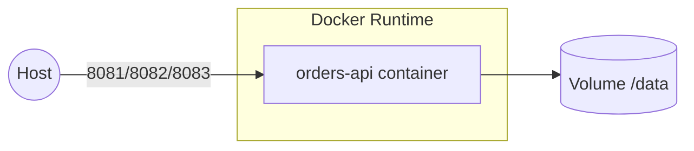

# Docker Lab: контейнеризация сервиса Orders API (Flask + SQLite)

> Время: 4 часа. Фокус на практику для **участников/студентов**: образы, слои, тома, сети и healthcheck.

## Что делаем

1. Собираем два образа: **naive** и **optimized (multi-stage, slim, non-root)**.
2. Запускаем контейнеры, настраиваем **HEALTHCHECK**, порты, переменные окружения.
3. Разбираем **persistency**: bind-mount vs named volume, проверяем сохранность `/data` между перезапусками.
4. Быстрый запуск через **Docker Compose** (порт 8083), затем мини-эквивалент в **kind/k8s** (NodePort 30081).

## Быстрый старт

```bash
# Сборка
./scripts/build-naive.sh
./scripts/build-optimized.sh

# Запуск
./scripts/run-naive.sh      # http://localhost:8081/health
./scripts/run-optimized.sh  # http://localhost:8082/health

# Compose вариант
./scripts/compose-quick.sh  # http://localhost:8083/health

# Диагностика
./scripts/inspect-layers.sh
```

Полезные эндпойнты: `/health`, `/orders?status=paid&limit=1`

## 4-часовой план

**0:00–0:30 — Сборка и сравнение образов**: кэш слоёв, `.dockerignore`, разница naive vs optimized.  
**0:30–1:15 — Запуск и диагностика**: `logs`, `exec`, проверка `/health`.  
**1:15–1:45 — Данные**: bind-mount vs volume, перезапуск и проверка сохранности.  
**1:45–2:15 — HEALTHCHECK**: поведение статуса, деградация при остановке БД (здесь — симулируем блокировкой файла).  
**2:15–2:45 — Compose**: один сервис, named volume, порт 8083.  
**2:45–3:45 — (Опционально) Security & k8s**: non-root, slim, скан (docker scout), NodePort 30081.  
**3:45–4:00 — Отчёт**: размеры/слои, выводы о persistency и health.

## Архитектура (Mermaid)



## Важно

- Пароли/ключи в примерах — только для учебной среды.
- Для продовой среды используйте slim-образы, non-root пользователя, SBOM/сканы и secrets.
- В k8s пример использует emptyDir — для постоянных данных применяйте PVC.

## Frontend

```Dockerfile
FROM node:18-slim

WORKDIR /app
COPY package*.json ./
RUN npm install
COPY . .

EXPOSE 3000
CMD ["node", "server.js"]
```

## Подключение к ВМ

### 1. Настроить VPN

1. Установка

OpenVPN Connect (рекомендуется): с сайта [openvpn.net](https://openvpn.net/client/) → Downloads → Windows → OpenVPN Connect.

2. Запуск

Откройте OpenVPN Connect → File → Import → From local file → выберите .ovpn.

3. Подключитесь

- Нажмите Connect → введите логин/пароль (если требуется).
- Разрешите доступ в брандмауэре Windows для OpenVPN (галочки и для Private, и для Public сетей).
