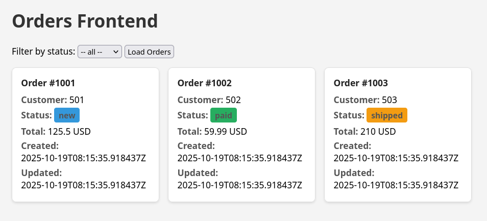

# 🧩 Самостоятельное задание: Настройка сервиса заказов

## 🎯 Задача

Необходимо написать `docker-compose.yml` для **backend** и **frontend** частей приложения, обеспечив при этом:

- 🌐 доступность frontend-приложения из браузера
- ⚙️ считывание переменных среды из `.env` файла
- 💾 сохранность базы данных при перезапуске backend
- 🔒 недоступность backend-приложения для сторонних запросов

---

## 📦 Исходные данные

1. Репозиторий с исходным кодом сервисов **frontend** и **backend** — `docker-lab/practice`
2. Готовый **Dockerfile** для backend и готовый **Dockerfile** для frontend.
   - В **Dockerfile** для frontend допущена ошибка — необходимо её исправить.
3. Стартовый (не заполненный) `docker-compose.yml`
4. Шпаргалка по командам — `docker-lab/docs/Шпаргалка.md`

---

## ✅ Ожидаемый результат

1. Исправлена ошибка в **Dockerfile** фронтенда
2. Создан файл `.env` и задана переменная окружения:
   - `BACKEND_HOST=orders-api`
3. Создан корректный `docker-compose.yml` файл:

   ### 🔹 Сервис backend (`orders-api`)

   1. Указан образ `docker-lab/orders-api:latest`
   2. Указано имя контейнера `backend-orders-api`
   3. Указан корректный контекст, используемый для сборки
   4. Примонтирован volume для сохранности БД `/data/orders.db`
   5. Указана сеть, общая с фронтендом

   ### 🔹 Сервис frontend (`orders-web`)

   1. Указан образ `orders-frontend`
   2. Указано имя контейнера `frontend-orders`
   3. Указан корректный контекст, используемый для сборки
   4. Открыт наружу порт **3001** (внутренний порт контейнера — **3000**)
   5. Подключён файл переменных окружения
   6. Указана сеть, общая с бэкендом

   ### 🔹 Общие параметры

   - Объявлена сеть
   - Объявлен volume

4. Контейнеры собраны и запущены через `docker compose`
5. Контейнеры запущены в **detached** режиме (неинтерактивно):

   - ✅ Фронтенд доступен в браузере (см. скриншот)
   - 🚫 Бэкенд не доступен напрямую из браузера

6. Проведён **мониторинг контейнера (одного из):**

   - Отображены логи контейнера
   - Отображены процессы контейнера (`docker top`)
   - Отображено использование ресурсов контейнерами (`docker stats`)

7. Проведено **обследование контейнера (одного из):**

   - Определено местоположение volume’а в системе
   - Определены характеристики сети
   - Определены переменные окружения, с которыми был запущен контейнер
   - Определена стартовая команда контейнера (`CMD`)
   - Определён образ, с которым был запущен контейнер

8. Выполнено **подключение к консоли контейнера**, отображён список файлов и директорий.

## Обратите внимание

1. Имена для контейнеров могут быть уже заняты другими, предыдущими контейнерами/сервисами. В таком случае, необходимо идентифицировать эти контейнеры `docker ps -a` и удалить их `docker rm <container_name/id>`

---

